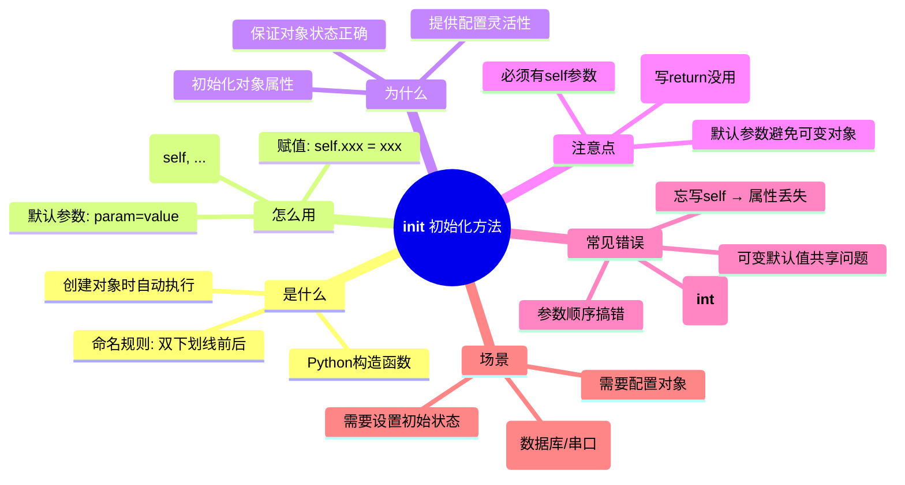

# Knowledge Log · 2026-01-20

> 自动生成：仅在调用【编程学习助手】Skill 时更新
> 目标：将真实学到的代码知识沉淀为可复习体系

## Index

- [11:20 Python __init__ 初始化方法](#1120-python-__init__-初始化方法)

---

## [11:20] Python __init__ 初始化方法

**Context**  
用户在阅读校电赛项目的 `auto_aim_vision.py`，遇到类的初始化方法不理解。

**Problem**  
不理解 `def __init__(self, camera_id=0, serial_port=None, baudrate=9600)` 是什么意思、默认参数如何工作。

**Key Idea**  
`__init__` 是 Python 类的构造函数，创建对象时自动执行，用于初始化实例属性。

### Explanation (Pro)

`__init__` 是 Python 类的**构造函数/初始化方法**，用于在创建对象时自动执行初始化操作。

```python
class AutoAimVision:
    def __init__(self, camera_id=0, serial_port=None, baudrate=9600):
        # 创建对象时自动执行
        self.camera_id = camera_id      # 保存参数为实例属性
        self.serial_port = serial_port
        self.baudrate = baudrate
```

**执行流程**：
```
调用类 → Python分配内存 → 自动调用__init__ → 返回对象
system = AutoAimVision(camera_id=1, serial_port='COM3')
           ↓
      创建对象
           ↓
   __init__(self, 1, 'COM3', 9600) 被执行
           ↓
   self.camera_id = 1
   self.serial_port = 'COM3'
           ↓
    返回已初始化的对象
```

**默认参数**：
- `=0`、`=None` 表示参数**可以不传**，使用默认值
- 提供了**调用灵活性**，同一套代码适应不同场景

### Example

```python
class Example:
    def __init__(self, name="默认名", age=18):
        self.name = name
        self.age = age
        print(f"创建对象: {name}, {age}岁")

# 三种调用方式
e1 = Example()                    # 使用全部默认值
e2 = Example("张三")               # name指定，age用默认
e3 = Example("李四", 25)           # 全部指定
```

### Pitfalls

| 坑 | 说明 |
|---|---|
| `self` 忘写 | 参数变成局部变量，对象访问不到 |
| `__init__` 写错 | 双下划线前后都要，如 `__int__` 会失效 |
| 默认参数是可变对象 | `def __init__(self, lst=[])` 会导致所有对象共享同一个列表 |
| 调用时位置搞错 | `Example(name, age)` 必须按顺序传参，或用 `Example(name="...", age=...)` |

---

### Plain Talk

**类比：订外卖时的"备注填写"**

- **类** = 外卖商家（定义好了能做什么）
- **对象** = 一份具体的外卖订单
- **__init__** = 订单创建时的"备注填写步骤"

```python
system = AutoAimVision(camera_id=0, serial_port='COM3')
#        ↓           ↓
#      点外卖      填备注：要0号摄像头、连COM3串口
```

**记忆钩子**：
> "创建对象先初始化，双下划线开头，self记属性"

**三句话总结**：
1. `__init__` 是对象出生时的"新手引导"
2. 默认参数是"如果不选，就默认给你这个"
3. `self` 是把东西存进对象的"保险箱"

---

### Mind Map



---

**Category**: Language / Python 面向对象编程  
**Tags**: `#python` `#oop` `#class` `#init` `#constructor` `#default-params`
